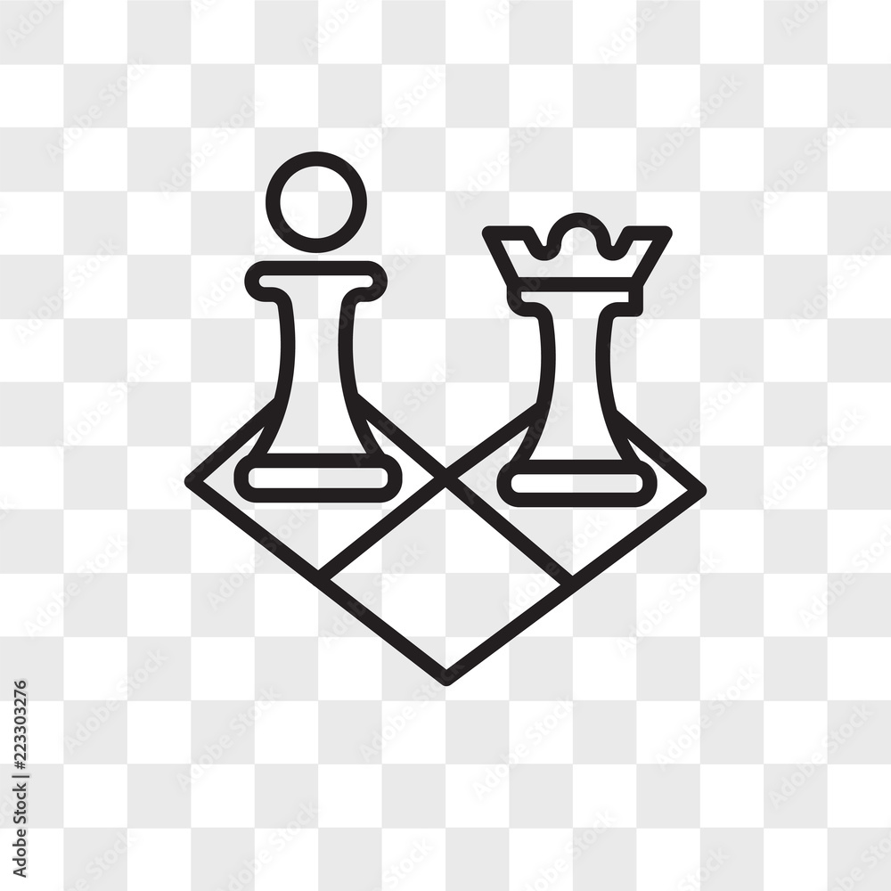

<!-- Improved compatibility of back to top link: See: https://github.com/othneildrew/Best-README-Template/pull/73 -->

<!--
*** Thanks for checking out the Best-README-Template. If you have a suggestion
*** that would make this better, please fork the repo and create a pull request
*** or simply open an issue with the tag "enhancement".
*** Don't forget to give the project a star!
*** Thanks again! Now go create something AMAZING! :D
-->

<!-- PROJECT SHIELDS -->
<!--
*** I'm using markdown "reference style" links for readability.
*** Reference links are enclosed in brackets [ ] instead of parentheses ( ).
*** See the bottom of this document for the declaration of the reference variables
*** for contributors-url, forks-url, etc. This is an optional, concise syntax you may use.
*** https://www.markdownguide.org/basic-syntax/#reference-style-links
-->

<!-- PROJECT LOGO -->
 

  

<h3 align="center">Chess with Ruby</h3>

  

    A chess game implemented in Ruby that runs in a command-line interface (CLI).
  

<!-- TABLE OF CONTENTS -->

  
Table of Contents

  <ol>
    <li>
      <a href="#about-the-project">About The Project</a>
      <ul>
        <li><a href="#built-with">Built With</a></li>
      </ul>
    </li>
    <li><a href="#acknowledgments">Acknowledgments</a></li>
  </ol>

<!-- ABOUT THE PROJECT -->
## About The Project

This project is part of my coursework on The Odin Project, a platform guiding my journey to becoming a full-stack developer. The goal is to create a fully playable chess game in Ruby, representing my most ambitious project to date. This endeavor aims to enhance my problem-solving skills, deepen my understanding of object-oriented programming (OOP), and refine my test-driven development (TDD) practices, while advancing my overall programming proficiency.

Chess is a complex game with unique movement patterns for each piece on an 8x8 board, all centered around the objective of capturing the opponent’s king. I anticipate facing numerous challenges throughout this project but am eager to address them and learn from the experience.

### Built With

* [![Ruby][Ruby-bagde]][Ruby-url]

<!-- ACKNOWLEDGMENTS -->
## Acknowledgments

* [The Odin Project](https://www.theodinproject.com/)
* [README template](https://github.com/othneildrew/Best-README-Template)

<!-- MARKDOWN LINKS & IMAGES -->
<!-- https://www.markdownguide.org/basic-syntax/#reference-style-links -->
[Ruby-url]: https://www.ruby-lang.org/en/
[Ruby-bagde]: https://img.shields.io/badge/Ruby-CC342D?style=for-the-badge&logo=ruby&logoColor=white
